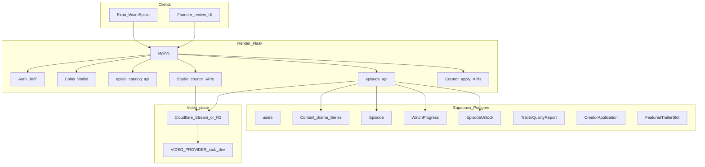

# WiamEpisio — End-to-End Blueprint (Execution Master)

**Version:** 2.0 · **Date:** 2026-07-18  
**Owner:** Martin Wiafe (Founder) · **Executor:** WiamEpisio Agent  
**Status:** ACTIVE — write while Martin finishes HTML mockups; **build starts after P0 mockups land** (or on Martin’s “build now” if he overrides)

---

## 0. How this document relates to others

| Document | Role |
|----------|------|
| [WIAMEPISIO_PHASE1_CLEARING_BLOCKERS.md](WIAMEPISIO_PHASE1_CLEARING_BLOCKERS.md) | Law: park novels, no delete, zero placeholders, Series = drama |
| [WIAMEPISIO_MOCKUP_SCREEN_INVENTORY.md](WIAMEPISIO_MOCKUP_SCREEN_INVENTORY.md) | Every screen to mock; what user sees; Studio tools; **video size specs** |
| [WIAMEPISIO_BACKEND_PRE_HTML.md](WIAMEPISIO_BACKEND_PRE_HTML.md) | Catalog/trailer/rankings/coins APIs already in code |
| [WIAMEPISIO_MASTER_BLUEPRINT.md](WIAMEPISIO_MASTER_BLUEPRINT.md) | Older vision (Jul 15) — **this E2E doc supersedes it for execution order & Creator Law** |
| [WIAMEPISIO_SLIM.md](WIAMEPISIO_SLIM.md) | `EPISIO_SLIM=1` skips heavy non-watch blueprints |
| `docs/AGENT_MEMORY.md` | Session truth |

**Brand (immutable):** `#08081A` · `#D4A017` · `#A07810` · Inter — match HTML mockups. Not DramaBox pink. Not brown/ember.

---

## 1. Product definition (one sentence)

**WiamEpisio** is WiamLabs’ Africa-first vertical short-drama app: users **watch** complete, quality-gated series for coins/VIP; creators **apply → private Studio → hard quality → soft interest → hybrid go-live → earn**; reading (Novel hub) is secondary; engine (auth, coins, wallet, RBAC, notifications, payouts) is **reused**.

---

## 2. Locked product laws

### 2.1 Quality first (Martin)

Hard quality **always** beats speed and soft social.

| Gate | Rule |
|------|------|
| Frame | Episode + trailer **9:16**; prefer **1080×1920**, min **720×1280** |
| Duration | Episode target **4–5 min** (accept **3:00–6:00**) |
| Trailer | **15–60s**, same aspect; **trailer QA** must pass |
| Completeness | **No half series** — all planned episodes Ready before public live |
| First public series | Planned count **≥ 20** episodes |
| Soft interest | **50 followers** OR **200 Remind-me** on teaser — **only after** hard gates ready |
| Soft cannot override | Interest met + quality fail = **still blocked** |
| Wrong size | Upload **rejected** with fix guidance (no silent accept) |

### 2.2 Creator ladder

```
Apply (+ sample) → Accepted → Private WiamStudio
  → Hard quality complete → Soft interest met
  → Submit → Hybrid live (reviewer ≤72h OR auto if green)
  → Earn (KYC for payout)
```

- Apply asks: identity, pitch, planned count, **sample** (clip / link / trailer draft), rights + complete-series checkboxes.  
- **Not** required at entry: 5×50 series (that is later **Verified / Origin** tier).  
- **Wiam Origin** = rights/signed exclusives only (Founder), not open apply.  
- Studio = upload + metadata + QA + submit. **No in-app NLE** (creators cut in CapCut/etc.).

### 2.3 Hybrid go-live

- Completeness + trailer QA (+ size/duration) must pass.  
- Reviewer acts within **72h** → human decision.  
- SLA expires + gates green + no policy flags → **auto live**.  
- Copyright/strike/policy flags → **human only**.  
- Founder can **unpublish** anytime.

### 2.4 Viewer economics

- Backend money **USD**; display via FX (e.g. GHS).  
- Coins = platform units; bands (standard/premium/origin/vip).  
- Free first **N** episodes (server; currently **5**).  
- VIP = membership surface (wire when products ready; no fake Subscribe).

### 2.5 Zero-placeholder (non-negotiable)

No shipped tap that does nothing. If a screen cannot be wired this phase → **do not ship it**; keep it out of nav until ready. (Mockups may show future states; production builds must not.)

### 2.6 Park, don’t delete

Legacy novel UI stays in `WiamAppMobile/_parked/`. DB tables for books/chapters stay. Novel hub may re-surface parked engines later.

---

## 3. Architecture (keep engine, replace product surface)



| Layer | Decision |
|-------|----------|
| Host | Render (`wiamapp.com`) — not Fly/Neon as current |
| DB | Supabase Postgres via `DATABASE_URL` |
| Mobile | Expo in `WiamAppMobile/` · package `com.wiamapp.mobile` |
| API base | `https://wiamapp.com/api/v1` (never broken `api.wiamapp.com`) |
| Video | `VIDEO_PROVIDER=cloudflare` when credentials set; else stub (no fake “playing” success) |
| Slim | `EPISIO_SLIM=1` default — watch path only |

---

## 4. End-to-end journeys (every tap must work)

### 4.1 Viewer — Watch money path (P0)

| Step | Screen (inventory) | API / system | Pass criteria |
|------|-------------------|--------------|---------------|
| 1 | Splash → Main | Local | Branded splash then tabs |
| 2 | Home | `GET /watch/home` | Chips, featured trailer, rails from DB |
| 3 | Hero / trailer | `GET /series/:id/trailer/stream` | Trailer plays or honest “no trailer” |
| 4 | Series detail | `GET /series/:id` + episodes | Synopsis, badges, Play |
| 5 | Episode list | `GET /series/:id/episodes` | Locks, free badges, coin prices |
| 6 | Player | `GET /episodes/:id/stream` | HLS/MP4 plays; YouTube-style frame |
| 7 | Progress | `POST /watch/save-progress` | Resume on Continue Watching |
| 8 | Locked ep | Unlock takeover | Price shown |
| 9 | Unlock | `POST /episodes/:id/unlock` | Debits coins; 402 → Buy Coins |
| 10 | Buy coins | `GET /coins/packages?currency=` + initialize | Checkout opens; balance updates |
| 11 | Auth | login/register | Guest can browse; unlock needs auth |
| 12 | My List | continue-watching + reminders | Real rows or empty state |
| 13 | Profile | `me` + balance | Sign out works |
| 14 | Membership | `GET /vip/status` | Real status or “plans soon” **only if** not claiming live IAP |

### 4.2 Creator — Apply → Studio → Live → Earn (P0/P1)

| Step | Screen | API / system | Pass criteria |
|------|--------|--------------|---------------|
| 1 | Apply intro → forms | `POST /creator/apply` (build) | Sample + rights stored |
| 2 | Submitted / Accepted / Rejected | Founder queue + notify | Push/email or in-app |
| 3 | Studio Home | `GET /creator/studio/series` | List drafts |
| 4 | Create series | `POST /creator/studio/series` | planned_episode_count set |
| 5 | Cover / banner | upload image endpoints | Specs enforced |
| 6 | Trailer | `POST .../trailer/upload` + QA | Pass/fail reasons visible |
| 7 | Episode upload | `POST .../episodes/upload` (build) | Reject non-9:16; processing status |
| 8 | Completeness | `series_publish_gate` | Submit disabled until Ready |
| 9 | Soft interest | followers OR remind count | Teaser publish allowed |
| 10 | Submit for live | `POST .../publish` or `/submit-review` | Enters queue + SLA clock |
| 11 | Hybrid live | worker + founder approve | Live in catalog or Needs changes |
| 12 | Earnings | existing creator earnings APIs | Only after live; KYC for payout |

### 4.3 Founder — Quality control (P1)

| Step | Screen | API | Pass criteria |
|------|--------|-----|---------------|
| Apply queue | Accept/Reject | founder apply routes | Studio access flips |
| Review queue | Approve / Changes | founder review routes | Live or notes to creator |
| Featured trailers | CRUD | `/founder/episio/featured` | Home hero updates |
| Flags | Trailer QA / complete series | `/founder/episio/flags` | Gates respect flags |
| Unpublish | Confirm | series status → unpublished | Removed from public home |
| Origin/VIP mark | Series flags | `PATCH .../series/:id` | Shelves update |

### 4.4 Secondary (P2 — ship only when wired)

- Novel hub (`GET /novel/hub`) + parked reader surfaces  
- Comments on episodes  
- Daily rewards polish  
- Full VIP IAP  
- Verified Studio tier (multi-series bar)

---

## 5. Data model (execution)

### 5.1 Already exist (reuse)

- `Content` (drama Series) — catalog flags, trailer fields, planned counts, Origin/VIP  
- `Episode` — video keys, duration, publish, unlock price  
- `WatchProgress`, `EpisodeUnlock`  
- `TrailerQualityReport`, `FeaturedTrailerSlot`, `CoinPriceBand`, `FxRate`, `SeriesRankingSnapshot`  
- `CreatorVideoUploadJob` (trailer path)  
- Auth / `CoinBalance` / ledger / notifications / follow / founder RBAC  

### 5.2 Net-new or extend (build in phases)

| Entity | Purpose |
|--------|---------|
| `CreatorApplication` | Apply form, sample URL/key, status pending/accepted/rejected, reviewer notes |
| Creator capability flag on User | `episio_studio_access` / reuse creator approval carefully for **video** (don’t auto-open novel Studio) |
| Episode upload job | Transcode status, reject reason (aspect/duration) |
| `SeriesReviewSubmission` | submitted_at, sla_deadline, decision, auto_live_eligible |
| `SeriesTeaser` / flag | Trailer-only public + Remind-me counts |
| `ContentReminder` | User Remind-me on coming soon / teaser |
| Aspect/duration validation | Service on upload (ffprobe or CF metadata) |

**Never drop** book/chapter/library tables.

---

## 6. API map (have vs build)

### 6.1 Have (Pre-HTML)

See [WIAMEPISIO_BACKEND_PRE_HTML.md](WIAMEPISIO_BACKEND_PRE_HTML.md):

- Watch home / rankings / shelves  
- Series + episodes + stream + unlock + progress  
- Trailer stream + creator trailer upload/QA + publish gate  
- Coins bands / packages+FX / founder episio flags & featured  

### 6.2 Build next (gap list)

| Area | Endpoints (names indicative) |
|------|------------------------------|
| Apply | `POST/GET /creator/apply`, founder `GET/POST .../apply/:id/decide` |
| Studio series CRUD | create/update series metadata, cover, banner |
| Episode upload | resumable upload → CF → attach Episode + validate 9:16/duration |
| Teaser | publish/unpublish teaser; remind counts |
| Soft interest | `GET .../series/:id/readiness` (quality + social + review state) |
| Review SLA | submit-review; cron `auto_live_due`; founder decide |
| Reminders | `POST/DELETE /series/:id/remind` |
| Search | series/creator search for Discover |
| Specs | public `GET /episio/media-specs` for Studio UI copy |

Wire Expo only to real routes. Stub provider returns clear errors — never fake playback URLs that 404 silently.

---

## 7. Mobile navigation (target shell)

```
Stack
  Splash
  Main Tabs: Home | Discover | Member | MyList | Profile
  Modals/Stack: SeriesDetail, TrailerPlayer, Player, Unlock, Auth,
                BuyCoins, Search, Notifications, Settings,
                CreatorApply*, WiamStudio*, NovelHub*
Founder: web-first review (or later Expo founder mode)
```

`*` = after apply/Studio APIs exist; until then **omit from production nav** (zero placeholder).

Partial shell already under `WiamAppMobile/src/screens/episio/` — rebuild/align to final mockups; do not un-park novel UI into tabs.

---

## 8. Video pipeline (blocking real E2E)

1. Martin provides **Cloudflare** credentials (Stream and/or R2 per `video_service` contract).  
2. Set Render env: `VIDEO_PROVIDER=cloudflare` + keys.  
3. Upload → store uid → webhook/poll ready → HLS URL on Episode.  
4. Validate metadata: width/height → aspect ≈ 9:16; duration band.  
5. Player: `expo-video` + signed URL; YouTube-style contained frame + fullscreen.  
6. Until CF live: Founder can seed test series only in staging; production Home may be empty-catalog honest state.

**Acceptance:** One real series, all planned eps, trailer QA pass → play ep 1–5 free → unlock ep 6 with coins → continue watching.

---

## 9. Phased delivery (build order)

### Phase A — Foundations (week 1 focus)

- Cloudflare wired + media specs endpoint  
- Aspect/duration reject on upload  
- Empty-catalog & error states honest  
- Align Expo shell to P0 mockups (colors, nav)

### Phase B — Viewer E2E

- Home chips + featured + shelves wired  
- Series detail + episode list + trailer + player  
- Unlock + coins packages + auth  
- My List (continue + reminders)  
- Profile guest/signed  

**Exit:** Every P0 viewer tap works on staging with one seeded series.

### Phase C — Creator E2E

- Apply flow + Founder accept/reject  
- WiamStudio: series, cover, trailer QA, episode upload, completeness  
- Soft interest + teaser  
- Submit + hybrid live worker  
- Needs-changes loop  

**Exit:** Test creator goes apply → live without engineer SQL.

### Phase D — Founder polish + money

- Featured trailers UI  
- Flags UI  
- Earnings/KYC path verified  
- Rankings recompute scheduled  
- Origin marking  

### Phase E — Secondary

- Novel hub  
- Search polish  
- VIP IAP  
- Comments (if product wants)  
- Verified Studio tier  

---

## 10. Screen → build matrix (summary)

Full UI list: [WIAMEPISIO_MOCKUP_SCREEN_INVENTORY.md](WIAMEPISIO_MOCKUP_SCREEN_INVENTORY.md).

| Priority | Groups | Build phase |
|----------|--------|-------------|
| P0 | Splash, Home, Series, Trailer, Player, Unlock, Coins, Auth, My List, Profile, Apply+Studio core, Specs, Completeness, Submit states | B + C |
| P1 | Rankings, Categories, Search, Notifications, Settings, Founder queues, Analytics, Earnings | B polish + D |
| P2 | Novel, Comments, Daily rewards, VIP checkout polish | E |

Martin continues mockups in parallel; agent implements against inventory + this blueprint, swapping HTML look when files arrive.

---

## 11. Acceptance test script (CEO / QA)

### Viewer script

1. Fresh install → Splash → Home (or empty honest state).  
2. Open featured trailer → plays.  
3. Open series → Play EP1 → finishes → auto or next.  
4. Continue Watching shows progress.  
5. Hit locked ep → Unlock → insufficient coins → Buy → return → Unlock → plays.  
6. Sign out → guest Profile → Sign in → balance persists.  
7. Remind Me on Coming Soon → appears in Reminders.  

### Creator script

1. Apply with sample → pending.  
2. Founder accepts → Studio opens.  
3. Create series planned 20 → upload cover → trailer → 20 eps (or staging min override for QA).  
4. Wrong-aspect ep rejected with message.  
5. Completeness green → soft interest path (teaser reminds or follows).  
6. Submit → within 72h approve OR wait auto → series on Home.  
7. Earnings page non-zero after unlocks (or staging credit).  

### Founder script

1. Reject bad apply with reason.  
2. Request changes on low-quality trailer.  
3. Feature a trailer on Home.  
4. Unpublish a live series → disappears from public rails.  

---

## 12. Non-goals (explicit)

- In-app multi-track video editor  
- Open upload without apply  
- Auto-live when trailer QA failed  
- Dropping novel DB / parked screens  
- Claiming WiamVox / WiamTrade live  
- Using `api.wiamapp.com`  
- Shipping “Coming soon” as a fake finished feature in production nav  

---

## 13. Risks & mitigations

| Risk | Mitigation |
|------|------------|
| No Cloudflare yet | Block Phase B playback; Studio upload waits; seed stub only in staging |
| Empty catalog at launch | Honest empty Home; Founder Origin slate first |
| Auto-live quality miss | First series prefer human; flags force human; unpublish |
| Fake followers | Soft path prefers Remind-me on teaser; rate-limit follows |
| Bandwidth cost | Cap 720p ladder early; coin price ≥ delivery unit economics |
| Agent rebuilds novels | Phase1 blockers + park rule |

---

## 14. Immediate next actions

| Who | Action |
|-----|--------|
| **Martin** | Continue HTML mockups (P0 first) per inventory; provide Cloudflare when ready |
| **Agent (now)** | This blueprint is source of truth for execution |
| **Agent (on “build” / P0 mockups in)** | Phase A → B → C; update `AGENT_MEMORY` each exit |
| **Both** | Do not mark E2E done until §11 scripts pass on staging |

---

## 15. Definition of Done — “End-to-end ready to use”

WiamEpisio is **E2E ready** when:

1. Viewer script §11 passes on staging (and production when Martin flips).  
2. Creator script §11 passes with **no manual DB edits**.  
3. Founder can accept apply, review series, feature trailers, unpublish.  
4. Every tap in the **shipped** nav is wired (no dead Profile “Upload” button).  
5. Video is real Cloudflare (or documented staging-only exception).  
6. Colors match HTML navy/gold.  
7. Quality gates cannot be bypassed by soft interest alone.

---

*End of WiamEpisio E2E Blueprint v2.0 — execute against this; mockups refine UI; laws do not soften without Martin.*
