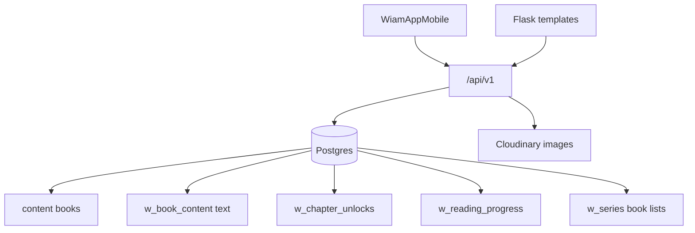
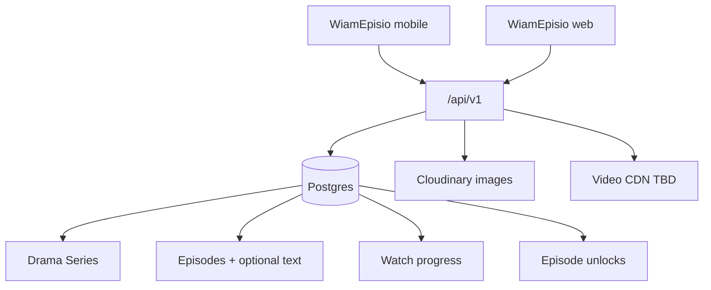

# WiamEpisio Migration Audit (Step 1) — COMPLETE

**Status:** Step 1 **DONE**. Audit only — no product code changed for this pivot.  
**Surfaces:** WebApp (`webapp/`) + Expo (`WiamAppMobile/`)  
**Source prompt:** `c:\Users\DELL\Downloads\WiamEpisio.txt`  
**Date:** 2026-07-15  
**Agent:** WiamEpisio Agent  

**Machine-complete inventory (every model / route / template / screen):**  
[`docs/WIAMEPISIO_INVENTORY_COMPLETE.md`](WIAMEPISIO_INVENTORY_COMPLETE.md)  
(regenerate: `python scripts/generate_episio_inventory.py`)

| Metric | Count |
|--------|------:|
| ORM models | 130 |
| Flask routes | 611 |
| Web HTML templates | 174 |
| Expo screens | 65 |

### Prompt coverage checklist

| Prompt asked for | Status |
|------------------|--------|
| frontend | DONE — §3 + inventory §D + nav map §8.2 |
| backend | DONE — §2, §5 + inventory §B |
| database / every model | DONE — §6 + inventory §A (130) |
| every API | DONE — inventory §B lists all 611 with handler names |
| authentication | DONE — §7.1 + §8.1 |
| wallet | DONE — §7.2 |
| WiamCoins | DONE — §7.3 |
| notifications | DONE — §7.4 |
| creator system | DONE — §7.5 |
| moderation | DONE — §7.6 |
| comments / likes / followers | DONE — §7.7 |
| search | DONE — §7.8 |
| analytics | DONE — §7.9 |
| admin dashboard | DONE — §7.10 + founder routes in inventory |
| uploads / storage | DONE — §7.11 |
| every page | DONE — inventory §C (174) + §D (65) |
| architecture + flows | DONE — §1, §8 |
| reusable / obsolete / migrate / remove / redesign | DONE — §9–13 |
| categories proposal | DONE — §17 |

Voice (`voice_api` + Voice* models) audited as **adjacent** (WiamVox), not Episio primary — do not delete.

---

## 1. Verdict

Production stack is a **novel reading + writer Studio** platform with mature platform layers (auth, coins, wallet, social, moderation, payments, push, analytics, RBAC). It is **not** a short-drama video platform yet: no episode video schema, no video CDN, no player.

**Feasible approach:** transform in place (WebApp + Expo), preserve platform systems, migrate content model Book/Chapter → Series/Episode, redesign discover + Studio + player.

**Critical collision:** Studio V2 `Series` (`w_series`) = ordered **books**. Episio Series = drama container with **episodes**.

**Useful adjacent pattern:** `VoiceStory` / `VoiceListenProgress` / `VoiceStoryUnlock` already model listen progress + unlock for audio — pattern reference for watch progress, not the Episio product itself.

---

## 2. Folder structure

### Repo (relevant)

| Path | Role |
|------|------|
| `webapp/` | Flask backend + HTML templates (Render → wiamapp.com) |
| `WiamAppMobile/` | Expo app (Android/iOS) |
| `WiamVoxMobile/` | Separate listen product — **out of Episio primary scope** |
| `docs/` | Agent memory + this audit |
| `scripts/qa/` | QA bot — retarget later |
| `.github/workflows/` | QA cron — do not break free-tier budget |

### WebApp internals

| Path | Role |
|------|------|
| `webapp/__init__.py` | App factory, blueprint registration |
| `webapp/models.py` | All ORM models (~128 classes) |
| `webapp/auth.py` | Web session auth helpers |
| `webapp/config.py` | Config |
| `webapp/extensions.py` | db, limiter, etc. |
| `webapp/routes/*.py` | 30 route modules |
| `webapp/services/*.py` | 40+ service modules |
| `webapp/templates/` | ~160 HTML pages/partials |

### Expo internals

| Path | Role |
|------|------|
| `app.json` / `app.config.js` | Brand WiamApp, scheme `wiamapp` |
| `src/navigation/` | Auth, Main tabs, Studio, Drawer, linking |
| `src/screens/` | 65 screen files |
| `src/api/` | 15 API modules |
| `src/store/` | auth store etc. |
| `src/components/` | UI (home rails, ads, brand) |
| `src/constants/theme.js` | Wine/gold brand tokens |

---

## 3. Frontend — Expo (every screen)

**Nav IA today:** Auth → Onboarding → Post-onboarding → Main tabs (Home, Browse, Library, Profile) + Studio stack + Drawer.

### Auth (12)

Landing, Login, Register, ForgotPassword, ResetPassword, OnboardingFlow, RegistrationFinish, Preparing, WelcomeBonus, PostOnboardingPremium, PostOnboardingCreator, PostOnboardingMission

### Main / hub (28)

Home, GuestHome, Browse, Library, Profile, GlobalSearch, Notifications, Settings, AccountSafety, Wallet, CoinHistory, TipHistory, Gifts, PremiumTab, WiamElite, CreatorSubscription, Programs, Hub, Schedule, Bulletin, Classics, OfflineReading, ReaderStats, ReadingStreaks, ReadingListDetail, HelpCenter, Careers, Feedback, WiamBot

### Content (5)

BookDetail, Reader, CreatorProfile, SeriesDetail (**books-in-series**), UniverseDetail

### Creator apply (2)

Apply, WelcomeCreator

### Studio legacy (8)

StudioDashboard, StudioTab, NewStory, StoryManager, ChapterEditor, Earnings, StoryAnalytics, OrderApprovals

### Studio V2 (9)

StudioLibrary, StudioSchedule, StudioMoney, StudioSettings, StudioProPaywall, UniverseEditor, SeriesEditor, AIComingSoon, StudioTourModal

### Expo API clients (`src/api/`)

`auth`, `books`, `reader`, `studio`, `studioV2`, `coins`, `wallet`, `creator`, `settings`, `bulletin`, `classics`, `elite`, `bot`, `tracking`, `client`

### Episio disposition (screens)

| Bucket | Screens | Action |
|--------|---------|--------|
| KEEP shell | Auth, Settings, Wallet, Notifications, Profile, Help, Careers | Brand/copy only |
| MIGRATE | Home, Browse, Library, BookDetail→Series, Reader→Player, Studio editors | Core pivot |
| REDESIGN | Discover rails, Studio upload, CreatorProfile channel | New UX |
| SECONDARY / PARK | Classics, OfflineReading (text), paragraph reader social, WiamBot novel tools | After watch core |
| RENAME caution | SeriesDetail, SeriesEditor | Not drama Series yet |

---

## 4. Frontend — Web templates (every page group)

**~160 templates.** Grouped:

### Public / reader

`landing`, `home`, `browse`, `search_results`, `genre_books`, `book_detail`, `reader`, `web_reader`, `library`, `favorites`, `creator_profile`, `notifications`, `about`, `privacy`, `terms`, `help_center`, `careers`, `community_guidelines`, `install_app`, `onboarding`, `reading_streaks`, `classics_*`, `elite*`, `premium_subscribe`, `bulletin*`, `programs/*`, `gift/*`, `payment/*`, `wiambot*`, legal (`data_deletion`, `delete_account`, `privacy_center`, `account_*`)

### Auth

`login`, `register`, `forgot_password`, `reset_password`, `verify_email`, `verify_2fa`, `settings_2fa`, `qr_login`, `switch_account`, `switch_verify`

### Studio (writer)

`studio/dashboard`, `editor`, `new_book`, `preview`, `monetization_guide`, `top_readers`

### Creator apply

`become_creator`, `become_creator_form`, `apply_*`

### Admin / founder / team / editor

`admin/*` (5), `founder/*` (~40 dashboards), `team/*` (role dashboards), `editor_studio/*`, `dashboard*`

### Episio disposition

- Public discover + book/reader → **redesign** to series/player  
- Studio templates → **redesign** Creator Studio  
- Auth/payment/legal → **keep**  
- Founder/admin → **evolve** (series/episodes/featured/revenue)  
- Classics/reader paragraph pages → **secondary**

---

## 5. Backend — APIs & blueprints

**~611 `@*.route` decorators** across route modules.

| Module | ~Routes | Prefix / role |
|--------|---------|----------------|
| `founder.py` | 143 | Founder ops dashboards |
| `api_v1.py` | 137 | **Primary Expo API** `/api/v1` |
| `studio_v2_api.py` | 30 | Universe/Series/Arc/Pro |
| `profile.py` | 27 | Web profile / creator upgrade |
| `voice_api.py` | 25 | **WiamVox** — adjacent |
| `studio.py` | 24 | Web writer Studio |
| `book.py` | 20 | Web book/reader |
| `api.py` | 18 | Legacy/misc API |
| `team.py` | 17 | Team RBAC dashboards |
| `editor_studio.py` | 14 | Editorial review |
| `admin_dash.py` | 13 | Admin |
| `programs.py` | 12 | Challenges/rising/etc. |
| `payment.py` | 11 | Checkout/coins web |
| `notifications.py` | 11 | Web notifications |
| `creator_sub.py` | 11 | Creator subscriptions |
| others | ≤10 each | home, browse, library, elite, gift, seo, classics, premium, bulletin, wiambot, apply, creator, dashboard, reader_api |

### `api_v1` endpoint inventory (complete list of paths)

**Health:** `/health`, `/health/db`, `/`  

**Auth:** `/auth/login`, `/register`, `/google`, `/forgot-password`, `/reset-password`, `/me`, `/check-username`, `/profile`, `/complete-registration`, `/avatar`, `/change-password`, `/delete-account`  

**Apply:** `/apply/submit`  

**Discover:** `/home`, `/recommendations`, `/recommendations/similar/<id>`, `/recommendations/genre/<g>`, `/search`, `/genres`, `/genres/preferences`, `/featured`, `/trending`, `/book-sections`, `/schedule/upcoming`  

**Books / library:** `/books`, `/books/<id>`, `/books/<id>/chapters/<n>`, `/books/<id>/library/toggle`, `/library`, `/books/<id>/favorite`, `/books/<id>/rate`, `/books/<id>/reviews` (+ POST/DELETE/like), `/books/<id>/tip`, `/books/<id>/record-view`  

**Reading lists:** `/reading-lists` CRUD + items  

**Reader social:** `/reader/save-position`, `/react`, `/reactions`, `/comment`, `/comments`, `/comment-counts`, `/comment/<id>/like|delete|report`, `/reader/stats`, `/reader/badges`  

**Notifications:** `/notifications` GET, read, mark-all-read, delete, clear  

**Gifts / programs:** `/gifts/received`, `/programs`  

**Creators:** `/creators/<id>`, `/follow`, `/my/following`, `/creator/earnings`, `/creator/dashboard`, `/creator/stories`, `/analytics`, `/followers`, `/creator/<id>/tiers`, `/creator/ad-earnings`  

**Coins / wallet / IAP:** `/coins/balance|history|packages|unlock|initialize|verify`, `/wallet/status|refund`, `/iap/confirm|confirm-subscription|packages`  

**Rewards / referral:** `/rewards/*`, `/referral/*`  

**Studio (mobile writer):** `/studio/stories` CRUD, chapter add/get/publish/delete, cover, settings, publish-all  

**Bulletin / push / ads:** `/bulletin/feed`, react; `/push-token`; `/ads/impression`, `/ads/reward-unlock`  

**Premium / elite / classics:** `/premium/*`, `/elite/*`, `/classics/*`  

**Security:** play-integrity, ios-integrity, nonce  

**Bot / settings / admin sections / track:** `/bot/chat|status`, `/settings`, `/admin/book-sections*`, `/track/home-impression|home-click|push-open`  

### Studio V2 API (summary)

Universes CRUD; Series CRUD + books add/remove/reorder; Arcs CRUD; chapter schedule; studio settings; Pro status/products/IAP; public series/universe; series-context; next-in-series; chapter access; search/v2; internal publish-due.

### Backend flow (today)

```
Client (Expo/Web)
  → Auth (JWT api_v1 / session web)
  → Discover (home_sections_v2 → Content books)
  → Open book → chapter text (WebBookContent.body)
  → Optional coin unlock (ChapterUnlock)
  → Progress (ReadingProgress)
  → Social (comments/likes/follows)
  → Creator Studio writes chapters + cover images (Cloudinary)
```

### Target backend flow (Episio)

```
Client
  → Same auth
  → Discover (series rails)
  → Open series → episode video stream
  → Free eps 1–5; else coins/subscription
  → WatchProgress
  → Episode comments/likes
  → Creator Studio: video + poster + trailer + schedule
```

---

## 6. Database — every model (130) + disposition

Full numbered list: [`WIAMEPISIO_INVENTORY_COMPLETE.md`](WIAMEPISIO_INVENTORY_COMPLETE.md) §A.

Legend: **K**=keep · **M**=migrate · **R**=redesign surface · **S**=secondary/park · **X**=remove only after replacement · **V**=Vox adjacent (don’t break)

### Identity & auth — K

`User`, `VerificationCode`, `WebSession`, `TrialDeviceFingerprint`, `TeamIdHistory`, `Role`, `Permission`, `RolePermission`, `UserRole`

### Core content — M (primary pivot)

`Content` (book→series), `WebBookContent` (chapter→episode + media fields), `Genre`, `FeaturedBook`, `BookSection`, `SectionSettings`, `BookCollection`, `CollectionItem`

### Progress / library — M

`ReadingProgress`, `UserLibrary`, `Bookmark`, `Shelf`, `ShelfItem`, `ReadingList`, `ReadingListItem`, `ReadingStreak`, `ReaderPreferences`, `UserGenrePreference`, `ReaderBadge`

### Access / commerce on content — M

`Access`, `Order`, `ChapterUnlock`, `MonetizationStatus`

### Coins & wallet — K (purpose M)

`CoinBalance`, `CoinTransaction`, `CoinPackage`, `PremiumCreditsLedger`, `PremiumReferral`, `LedgerEntry`, `SystemWallet`, `RefundRequest`, `FraudAlert`, `RevenueRule`, `PlatformFeeSettings`, `CommissionSettings`

### Creator money — K

`CreatorEarnings`, `CreatorPayout`, `CreatorPayoutSettings`, `CreatorWithdrawal`, `CreatorSubTier`, `CreatorSubscription`, `CreatorSubEarning`, `CreatorMilestone`, `CreatorProfile`

### Social — M labels/scope

`Follow`, `Favorite`, `Rating`, `Review`, `ReviewLike`, `ChapterComment`, `ChapterCommentLike`, `ChapterLike`, `ChapterVote`, `ShareEvent`, `StickerGift`, `GiftBook`, `GiftSubscription`

### Paragraph social — S (text editions)

`ParagraphReaction`, `ParagraphComment`, `ParagraphCommentLike`

### Notifications — K (copy M)

`Notification`, `PushSubscription`, `ExpoPushToken`, `Announcement`, `EmailJob`

### Moderation — K

`Report`, `BannedWord`, `ContentReport`, `ContentFlag`, `ModerationLog`, `UserWarning`, `Feedback`, `AuditLog`

### Elite / Premium / Programs — K/R gates

`EliteStory`, `EliteSubscription`, `EliteReadLog`, `PremiumSubscription`, `StoryChallenge`, `ChallengeEntry`, `MagicBox`, `MagicBoxReward`, `Referral`, `AdImpression`, `FeatureFlag`, `PlatformConfig`, `PlatformSetting`

### Bulletin — K/R (share series not books)

`BulletinPost`, `BulletinFollow`, `BulletinReaction`

### Team / hiring — K

`ApplicationForm`, `ApplicationResponse`, `TeamCompPlan`, `TeamPayroll`, `TeamPayrollSettings`

### Editorial / Apex — R/S

`ApexSubmission`, `EditorialNote`, `ReviewQueue`

### Media — K images; video NEW

`ImageStore` (K); **no VideoAsset model today**

### Popularity / analytics — M event names

`BookPopularityScore`, `AnalyticsEvent`

### Studio V2 — R naming

`Universe`, `Series`, `SeriesContent`, `Arc`, `StudioProSubscription`, `CreatorSettings`, `AISuggestion`

### Classics — S

`ClassicBook`, `ClassicChapter`, `ClassicFetchLog`

### Voice / WiamVox — V

`VoiceStory`, `VoiceMoment`, `VoiceMomentLike`, `VoiceMomentComment`, `VoiceStorySave`, `VoiceStoryUnlock`, `VoiceListenDayBucket`, `VoiceListenProgress`, `VoiceListenPresence`, `VoiceStoryRoomMessage`

### Misc — K

`BotUnmatchedMessage`

---

## 7. Domain deep-pass (prompt list)

### 7.1 Authentication — KEEP

- Web: session (`auth.py`, login/register templates, 2FA, QR, switch account)  
- Mobile: JWT via `/api/v1/auth/*` (email, Google, avatar, delete)  
- WIAMid / team accounts / RBAC intact  
- **Episio:** no new auth stack; brand strings only  

### 7.2 Wallet — KEEP

- `/wallet/status`, refund; ledger; Paystack flows in `payment.py`; fraud/risk on User  
- **Episio:** same wallet; spend targets become episodes  

### 7.3 WiamCoins — KEEP + MIGRATE purpose

- Balance/history/packages; `/coins/unlock` → chapters today  
- IAP confirm paths  
- **Episio:** unlock episodes; premium series; tips; early access; collectibles later  
- Free-first-5 rule must land in unlock + access helpers  

### 7.4 Notifications — KEEP + MIGRATE copy

- DB + Expo push + web push; settings `notif_*` including `notif_new_chapter`  
- **Episio:** add/rename “new episode”; keep follow/comment/like/coins  

### 7.5 Creator system — REDESIGN Studio, KEEP money/social

- Apply → approval → Studio write chapters + cover  
- Earnings, payouts, monetization eligibility, Studio Pro, analytics per story  
- **Episio:** Creator Studio = video/poster/trailer/schedule/monetization/analytics  
- Creator profile → channel page (series, views, followers, verified)  

### 7.6 Moderation — KEEP

- Reports, flags, banned words, founder moderation UI, content guard services  
- **Episio:** extend to video reports + AI moderation later (prompt asks); don’t remove  

### 7.7 Comments / likes / followers — MIGRATE scope

- Chapter + paragraph + review likes; Follow on creators  
- **Episio:** episode-level comments/likes primary; paragraph → optional text edition  
- Followers stay  

### 7.8 Search — MIGRATE

- Web: `search_results.html`  
- API: `/api/v1/search` (books + creators); studio `/search/v2`  
- **Episio:** series + creators + categories; trailers metadata  

### 7.9 Analytics — KEEP engine, MIGRATE events

- `services/analytics.py` → `AnalyticsEvent`  
- Home impression/click, book_view, publish, follow, search, push_open  
- Founder analytics pages (content/users/platform)  
- Creator story analytics endpoint  
- **Episio:** watch_start, watch_complete, episode_unlock, trailer_view, continue_watching  

### 7.10 Admin / founder dashboard — EVOLVE

- Admin: users, content, creators, orders, overview  
- Founder: content, coins, payouts, moderation, genres, sections, revenue, elite, classics, email studio, payroll, etc.  
- Team role dashboards + editor studio review  
- **Episio:** manage Series, Episodes, Featured, Subscriptions, Coins, Reports, AI moderation, Analytics  

### 7.11 Uploads / storage — KEEP images; ADD video

**Today**

- Covers/avatars: Cloudinary (`image_service.py`) + `ImageStore` + some local `/creator/studio/covers/`  
- Chapter body: text in Postgres  
- Bulletin: no direct video upload  
- Voice API: audio upload path (Vox) — separate  

**Missing for Episio**

- Video object storage + CDN/streaming  
- Episode upload API + processing status  
- Poster/trailer assets (images can reuse Cloudinary)  
- Client players (Expo + web)  
- Duration gate (≥1.5 min)  

---

## 8. Architecture diagrams

### Current



### Target



*(Detailed auth / nav / viewer / creator / money flows: §18 below.)*

---

## 9. Reusable systems (KEEP)

1. User / WIAMid / Google+email auth / 2FA / delete-account  
2. RBAC + team accounts + founder/admin shells  
3. WiamCoins + packages + ledger + IAP + Paystack  
4. Wallet / refunds / fraud score  
5. Notifications + Expo push  
6. Followers, tips, gifts, creator subs  
7. Moderation / reports / banned words  
8. Analytics `track()` + popularity scoring engine  
9. Home section rotator engine (swap fetchers)  
10. Scheduling publish fields  
11. Image CDN  
12. Premium/Elite entitlement machinery (retarget)  
13. Programs/referrals/rewards (retarget copy)  
14. SEO infrastructure (update entity types)  
15. Integrity / Play Integrity hooks  

---

## 10. Systems to MIGRATE

| From | To |
|------|-----|
| Content type book | Drama Series |
| Chapter text unit | Episode video (+ optional script/novel) |
| ChapterUnlock | EpisodeUnlock (same economics) |
| ReadingProgress | WatchProgress (+ keep reading for optional text) |
| Continue reading rails | Continue watching |
| Home novel sections | Trending / New / For You / Trailers / Creators / African Originals |
| `/coins/unlock` chapter | episode |
| Studio chapter editor | episode upload + metadata |
| `notif_new_chapter` | new episode |
| Search books | search series |
| Book SEO JSON-LD | VideoSeries / Episode-like |
| Brand WiamApp | WiamEpisio (documented checklist) |
| Categories/genres | drama taxonomy |

---

## 11. Systems requiring REDESIGN

- Discover UI (web + Expo Home/Browse)  
- Player (new)  
- Creator Studio (web + Expo)  
- Creator channel profile  
- Admin/founder content tools for series/episodes  
- Onboarding genres/copy  
- SeriesDetail/SeriesEditor (resolve naming collision)  
- Monetization UX copy (unlock episode after #5)  

---

## 12. Obsolete / secondary / remove-later

| System | Disposition |
|--------|-------------|
| Paragraph comments/reactions | Secondary (optional novel version) |
| Classics | Park / secondary text |
| PDF download / generated PDF | Deprecate for drama primary |
| Quick/Long Reads home sections | Replace |
| Novel-only WiamBot writing helpers | Park or retarget |
| Offline text reading pack | Secondary |
| Studio V2 Series-as-books product meaning | Remap/rename before Episio Series ships |
| **Do not delete** Voice* / WiamVox | Adjacent product |

**Remove only after replacement exists** — never delete project or drop tables without migration doc.

---

## 13. Counts summary

| Inventory | Count |
|-----------|------:|
| ORM models | **130** (full list in inventory §A) |
| Flask routes | **611** (full list in inventory §B) |
| api_v1 routes | 137 |
| founder routes | 143 |
| Web HTML templates | **174** (inventory §C) |
| Expo screens | **65** (inventory §D) |
| Expo API modules | 15 |
| Web services | ~40 (inventory §F) |
| Video episode models | **0** |
| Video CDN integration | **0** |

---

## 14. Naming collision (blocking decision)

| Name | Today | Episio |
|------|-------|--------|
| Series | `w_series` = list of books | Drama series of episodes |
| Episode | `content_kind` label on text chapter | Video episode |
| Chapter | Primary unit | Secondary / optional text |

**Step 2 must choose:**  
- **A)** New drama tables; rename product language for `w_series` → “Story collection”  
- **B)** Repurpose `Content` + `WebBookContent` as series/episodes; migrate `w_series` separately  

---

## 15. Explicit non-actions (this step)

- No code deletion  
- No schema drops  
- No brand mass-replace  
- No video vendor lock-in without founder decision  

---

## 16. Next step (Step 2 — not started)

**Step 2 doc:** schema option A vs B + video provider shortlist + free-first-5 unlock rule location + API compatibility aliases — still no feature implementation until accepted.

---

## 17. Categories — current vs proposed (prompt)

**Today:** `Genre` table + founder CRUD (`/genres`); onboarding `UserGenrePreference`; home “Popular in &lt;Genre&gt;”; browse `/browse/genre/<name>`. Genres are novel-oriented (seeded in DB, not hard-coded in models).

**Prompt suggestions:** Drama, Romance, Comedy, Action, Thriller, Mystery, Crime, Fantasy, Sci-Fi, Adventure, Family, History, Animation, Documentary, African Originals.

**Recommended Episio taxonomy (proposal only — decide in Step 2):**

| Tier | Categories |
|------|------------|
| Primary (home chips) | Drama, Romance, Thriller, Comedy, Action, Fantasy, African Originals |
| Secondary | Mystery, Crime, Sci-Fi, Adventure, Family, History, Animation, Documentary |
| Meta rails (not genres) | Trending, New Releases, Continue Watching, Trailers, Featured Originals, Popular Creators |

Keep `Genre` table; remint names via founder genres UI; map old novel genres → closest drama category during content migration.

---

## 18. End-to-end flows (current understanding)

### 8.1 Auth flow

1. **Web:** email/password or Google → Flask session; optional 2FA; auth gates from `PlatformConfig`.  
2. **Expo:** `/api/v1/auth/login|register|google` → JWT; `/auth/me`; registration finish + onboarding flags on `User`.  
3. **Team:** WIAMid team accounts → team dashboards only.  
4. **Episio:** reuse entirely; change product name in UI strings later.

### 8.2 Expo navigation map

```
AppNavigator
├── Auth (GuestTabs: Home/Browse/Search/Login + Login/Register/Forgot/Reset + BookDetail/Reader)
├── RegistrationFinish
├── Onboarding
├── PostOnboarding (WelcomeBonus → Premium → Creator → Mission)
└── Main (Drawer)
    ├── MainTabs: Home | Browse | Library | Profile
    ├── Stack: BookDetail, Reader, Wallet, Notifications, Studio, SeriesDetail, …
    └── Studio stack: Library|Editor|Schedule|Money|Settings + NewStory/ChapterEditor/SeriesEditor/…
```

### 8.3 Viewer flow (today → Episio)

| Step | Today | Episio |
|------|-------|--------|
| Land | Home rails of books | Home rails of series |
| Open | BookDetail | Series detail |
| Consume | Reader (chapter text) | Player (episode video) |
| Gate | ChapterUnlock / premium credit | Episode unlock after ep 5 / sub |
| Resume | ReadingProgress | WatchProgress |
| Social | Chapter/paragraph comments | Episode comments |

### 8.4 Creator flow (today → Episio)

| Step | Today | Episio |
|------|-------|--------|
| Apply | become-creator / ApplyScreen | same |
| Create | NewStory + ChapterEditor (text) | New Series + Episode upload |
| Cover | Image → Cloudinary | Poster + trailer (image/video) |
| Publish | chapter publish/schedule | episode publish/schedule |
| Monetize | lock chapter coins | lock episode after #5 |
| Measure | StoryAnalytics | Series/episode analytics |

### 8.5 Money flow (keep)

Buy coins (Paystack/IAP) → `CoinBalance` → unlock → `ChapterUnlock` (→ EpisodeUnlock) → creator share via `PlatformConfig.creator_revenue_pct` → earnings/payouts. Wallet refunds/fraud remain.

---

## 19. Step 1 completion stamp

- [x] Understood existing project (WebApp + Expo) without deleting it  
- [x] Did not write product feature code for the pivot  
- [x] Documented folder structure, architecture, backend/frontend flows  
- [x] Documented reusable / obsolete / migrate / remove / redesign  
- [x] Inventories: every model, every route, every template, every Expo screen  
- [x] Domain coverage: auth, wallet, coins, notifications, creator, moderation, social, search, analytics, admin, uploads/storage  
- [x] Categories proposal recorded  
- [x] Blocking decisions deferred to Step 2 (schema A/B, video provider)

**STEP 1 IS COMPLETE.**
