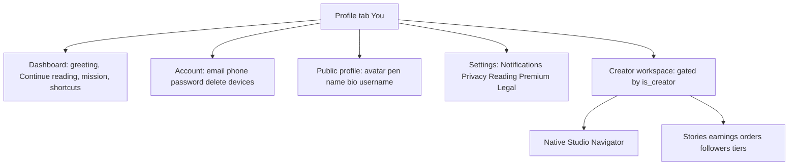

# WiamApp reader and creator plan v1

**Purpose:** Exhaustive snapshot of today’s Profile / Settings / Drawer surfaces; what stays, moves, or is removed under a cleaner IA; a **complete Settings backlog** so nothing is forgotten; backend/database capabilities that exist but are under-exposed or web-only.

**Audience:** Planning only. Implementation proceeds in phases after confirmation.

---

## Part A — Inventory: what exists today

### A1. Drawer ([`CustomDrawerContent.js`](WiamAppMobile/src/navigation/CustomDrawerContent.js))

| Item | Visible if | Routes to |
|------|-------------|-----------|
| Overview (tabs) | all | MainTabs |
| My Library | all | Library tab |
| Wiam Coins | all | Wallet |
| Offline Reading | all | OfflineReading |
| Settings | all | Settings |
| Notifications | all | Notifications |
| WiamStudio | creator only | Studio |
| Bulletin Feed | all | Bulletin |
| My Sticker Gifts | all | Gifts |
| Sticker History | creator only | Gifts (same as gifts) |
| Coin History | all | CoinHistory |
| Tip History | all | TipHistory |
| Programs | all | Programs |
| Reading Streaks | all | ReadingStreaks |
| WiamElite | all | WiamElite |
| WiamApex | all | WiamElite (duplicate destination) |
| WiamPremium | all | PremiumScreen |
| Feedback | all | Feedback |
| Account Safety | all | AccountSafety |
| Help Center | all | HelpCenter |
| WiamBot Chat | all | WiamBot |
| Careers | all | Careers |
| Become a Creator | readers | Apply |
| Log out | all | logout |

### A2. Profile tab ([`ProfileScreen.js`](WiamAppMobile/src/screens/main/ProfileScreen.js))

**Declared tabs**

| Tab key | Label (UI) | What actually renders |
|---------|-------------|------------------------|
| `overview` | Overview | Full overview (see below) |
| `account` | Account | **BUG:** not in `renderTabContent` switch → falls through to **Overview** |
| `settings` | Settings | Dedicated settings tab (different from Drawer Settings screen) |
| `security` | Security | **BUG:** not in switch → **Overview** |
| `support` | Support | **BUG:** not in switch → **Overview** |
| `creatorHub` | Creator Hub | Creator hub |
| `creatorFollowers` | Followers | Followers list |
| (+ implied) Extra renderers exist but **no tab** | `creatorStories`, `creatorEarnings`, `creatorOrders`, `creatorSubs`, `library`, `profile` | Wired in switch but **not in `tabs`** array |

**Overview tab contents**

- Horizontal **Quick Links:** Notifications, Bulletin, Coins, Offline, Gifts, Tips, Stickers (creator), Stats, Programs, Elite, Apex, Coin History, Premium, Studio (opens **web URL** — not native Studio), Feedback, Help, Bot, Careers.
- **Creator block** (if creator/founder): dashboard stats (`creatorApi.getDashboard`), “Open WiamStudio on Web”.
- **Reader stats strip:** Books in library count; **RATINGS / REVIEWS / FOLLOWING are hardcoded `"0"`** (not wired to APIs).
- `FirstMissionCard`.
- Continue reading carousel.
- Become a Creator CTA (readers).
- Feedback card + large Support links (Terms, Privacy, About, Guidelines, Privacy Center duplicate, Bot, warnings → AccountSafety).

**Settings tab inside Profile**

- Email (read-only), phone placeholder (“soon”).
- Push + Email toggles only (`push_enabled` / `email_notifications` via [`settingsApi`](WiamAppMobile/src/api/settings.js)).
- Change password + delete account.

**Creator-only tabs**

- Creator Hub (native Studio navigate + Order approvals + web dashboard links).
- Followers list from `creatorApi.getFollowers`.

**Silent code paths**

- `renderCreatorStories`, `renderCreatorEarnings`, `renderCreatorOrders`, `renderCreatorSubs`, `renderLibrary`, `renderProfile` exist but **tabs do not expose** Creator Stories/Earnings/Orders/Subs/Library/Profile tabs.

### A3. Settings screen ([`SettingsScreen.js`](WiamAppMobile/src/screens/main/SettingsScreen.js)) — Drawer entry

**Implemented**

| Section | Features |
|---------|----------|
| Profile header card | Avatar, display name, @username, premium badge |
| Account | Inline edit display name, inline edit bio, email row (read-only), member since |
| Notifications | Push, Email only (`toggleNotif`) |
| Premium | Row → PremiumScreen |
| Account actions | Log out |

### A4. Account Safety ([`AccountSafetyScreen.js`](WiamAppMobile/src/screens/main/AccountSafetyScreen.js))

- Static “secure” card; email + provider from user.
- 2FA + Login alerts switches → **Alerts only (“Coming soon”)**, no backend.
- Download data → **Alert placeholder**.
- Delete account → redirect user to Profile tab (real delete lives in Profile).

---

## Part B — Removals / moves / merges (recommended)

Legend: **R** Remove from this surface, **M** Move to named target, **K** Keep, **D** Deduplicate (one canonical entry).

### B1. Profile `Overview`

| Element | Decision | Target |
|---------|----------|--------|
| 15+ quick links duplication of Drawer | **D** | Keep **compact** shortcuts (Continue reading, Notifications, Coins, Offline) ; rest “See all in Explore” → Drawer sections or grouped **Tools** subsection |
| “Open Studio” via `Linking.openURL(web)` next to Creator native entry | **M** | Single **Open WiamStudio** → native [`StudioNavigator`](WiamAppMobile/src/navigation/StudioNavigator.js); optional tertiary “Advanced on web” |
| Creator stats duplicate | **K** once | Creator hub section only |
| Support legals reproduced (Terms/Privacy…) | **M** → **Settings/Support** subgroup or footer |
| Ratings / Reviews / Following = 0 fake | **R** placeholders | Wire real endpoints or hide until wired |
| `FirstMissionCard` | **K** | Reader engagement |
| Tabs Account / Security / Support | **K** intent | Implement real panels or **remove tab labels** to avoid placebo |

### B2. Profile inner “Settings” tab vs Drawer `Settings`

| Element | Decision |
|---------|----------|
| Two places for push/email | **D** Drawer **Settings** = canonical Preferences |
| Password + delete in Profile | **M** → **Account & security** subsection (within Settings hub or standalone Account screen) |
| Duplicate profile edits (Screen vs Profile Overview) | **D** Prefer **Profile** screen for avatar/name/bio; Settings links into it |

### B3. Creator-only extras

| Element | Decision | Target |
|---------|----------|--------|
| “Stories / Earnings / Orders / Subscribers” renderers hidden | **K** expose | Tabs or accordion under **Creator workspace** |

### B4. Items to REMOVE from Profile clutter (spirit of “good arrangement”)

- Duplicate navigation to Apex and Elite pointing to **same screen** (`WiamElite` twice`) — consolidate to one Elite row unless Apex is distinct route later.
- Sticker History → same `Gifts` route as gifts — differentiate in-app tabs or merge label.

---

## Part C — Full Settings specification (everything that belongs + backend status)

Everything users reasonably expect under **Settings** for a mature reading app — **even if not built yet**. Mark: **DONE** mobile+API, **API** backend ready / partial, **DB** stored, **GAP** needs work.

### C1. Account & identity

| Feature | Goal | Backend / DB today | Mobile |
|--------|------|---------------------|--------|
| Email displayed | SEE | [`User.email`](webapp/models.py) | Drawer header, Profile, Settings ✓ |
| Email verify / change | FLOW | VerificationCode, web flows likely | **GAP** in app |
| Phone number | SEE/EDIT | `User.phone` | Profile placeholder only — **GAP** API + PATCH |
| Password change | FLOW | Existing auth helpers | Profile Settings tab ✓ |
| Delete account | FLOW | Uses password | Profile ✓ ; AccountSafety redirects — unify |
| Auth provider badge | SEE | `User.auth_provider` | AccountSafety ✓ |
| Connected accounts (Google…) | FLOW | `google_id`, etc. | **GAP** linking UI |
| 2FA | FLOW | `User.two_factor_enabled`, `two_factor_secret` columns | Placeholder switches — **GAP** |
| Sessions / Active devices | SEE/REVOKE | May need AuditLog-style table | **GAP** |
| Account region | SEE/EDIT | `User.account_region` | **GAP** exposure |

### C2. Public profile & privacy (`User` privacy columns exist — **mostly not in** [`GET/PATCH /api/v1/settings`](webapp/routes/api_v1.py))

| Feature | DB column | Mobile |
|--------|-----------|--------|
| Profile visible | `privacy_profile_visible` | **GAP** |
| Show reading activity | `privacy_show_reading_activity` | **GAP** |
| Show library to others | `privacy_show_library` | **GAP** |
| Show favorites | `privacy_show_favorites` | **GAP** |
| Username | `User.username` | Shown ; edit via profile endpoint if exposed — **GAP** consistency |
| Pronouns / visibility | `pronouns`, `show_pronouns` | **GAP** in Settings (may exist elsewhere in registration flows) |
| DOB visibility | `dob_visible`, `date_of_birth` | **GAP** in Settings |

### C3. Notifications (`User.notif_*` — granular API mirrors exist; UI mostly hidden)

Already returned in `GET /api/v1/settings` under `notification_preferences`:

- `push_enabled` → `notif_push`
- `email_enabled` → `notif_email`
- `new_chapter`, `new_follower`, `comments`, `likes`, `mentions`, `announcements`, `coins`, `elite`
- `sound` → **`notif_sound`** is **`Text`** in DB (`chime`, `bell`, …) — treating as strict boolean on wire may be fragile; expose as **preset picker** instead.

**UI today:** Profile + Drawer Settings expose **only 2 master toggles**. **PLAN:** Add grouped toggles matching server + “notification sound style” picker.

### C4. Reading experience

| Feature | Goal | Backend today | Mobile |
|---------|------|---------------|--------|
| Reader theme | SET | [`ReaderPreferences`](webapp/models.py): `theme` | Persisted via **web session** [`POST /api/reader/pref`](webapp/routes/reader_api.py) (`login_required` only) — **JWT GAP** |
| Font size / family | SET | Same model | Same **GAP** |
| Line spacing | SET | Same | Same **GAP** |
| Default scroll resume | BEHAVIOR | Reading progress APIs exist elsewhere | Consolidate UX copy in Settings linking Reader behavior |
| Download / Offline policy | SEE | OfflineReadingScreen exists | Add **preferences** subsection (Wi‑Fi only, quality) if product wants |

### C5. Content & personalization

| Feature | Goal | Backend | Mobile |
|---------|------|---------|--------|
| Genre preferences | SET | [`/genres/preferences`](webapp/routes/api_v1.py) | Surface in Settings/Recommendations — **GAP** |
| Taste / onboarding genres | SEE | Stored from onboarding flow | Surface “Edit interests” shortcut |

### C6. Premium & monetization

| Feature | Status |
|---------|--------|
| Premium status, plan row | Drawer Settings ✓ |
| Renewal / Manage subscription | Depends on IAP (RevenueCat) — deepen **GAP** parity |
| Coin purchase history shortcut | Exists as Coin History screen → link |

### C7. Support & compliance

| Feature | Placement |
|---------|-----------|
| Help Center | Drawer ✓ → also Settings footer links |
| Feedback | Drawer ✓ |
| Terms / Privacy / Community / Data deletion URL | Canonical list in Settings Legal |
| Careers | Drawer ✓ |

### C8. Advanced / Creator-adjacent in app Settings hub

Readers should NOT see Creator Studio toggles. Creators SHOULD see extras:

| Feature | Backend | Placement |
|---------|---------|-----------|
| Default unit label (chapter/part/…) | [`CreatorSettings.default_unit_label`](webapp/models.py) | Link to Studio Settings or replicate read-only summary |
| Studio tool visibility flags | Same model via [`/studio/settings`](webapp/routes/studio_v2_api.py) | **Creator only** subgroup |
| **Scheduled-publish self-notification** | `CreatorSettings.notif_scheduled_publish` | **Creator only:** “Alert me when a scheduled episode goes live” |

---

## Part D — Target IA (information architecture)

- **Readers:** No Creator workspace subtree.
- **Creators:** Auto-expand Creator workspace subtree when `user.is_creator` (already partially true).

---

## Part E — Backend/database “hidden jewels” checklist

Capabilities that appear in [`User`](webapp/models.py), related tables, or web-only routes but are **missing or awkward** on mobile JWT:

| Asset | Possible product use |
|-------|----------------------|
| `ReaderPreferences` + `/api/reader/pref` | Migrate to JWT `GET/PUT /api/v1/me/reading-preferences` mirroring columns |
| `privacy_*` on `User` | Extend `GET/PATCH /settings` payload + Settings UI Privacy section |
| Full `notif_*` excluding sound type bug | Notifications settings screen parity |
| `two_factor_*` columns | Proper 2FA setup flow behind Account |
| **`GET/PATCH settings` assigning `display_name`** | **`User.display_name` is a computed `@property`** (first+last names). Auditing setter behavior against SQLAlchemy is required — may silently fail or misuse; unify with `@auth`/profile PATCH that edits `first_name`/`last_name` |
| `referral_code` / `referred_by` | Optional “Invite friends” subsection |
| Genre preferences route | Dedicated Settings card |
| `CreatorSettings` suite | Explicit “Creator preferences” surfaced for creators |

---

## Part F — Cross-cutting bugs (explicitly tracked in v1 rollout)

| Issue | File / area |
|-------|---------------|
| `postOnboardingPending` used without reading from [`useAuthStore`](WiamAppMobile/src/store/useAuthStore.js) | [`AppNavigator.js`](WiamAppMobile/src/navigation/AppNavigator.js) |
| `authPhaseKey` ignores post-onboarding phase | Same |
| Bulletin feed `creator` lacks `User.id`; mobile expects `creator.id` for CreatorProfile (`/creators/:id`) | Backend feed + [`BulletinScreen`](WiamAppMobile/src/screens/main/BulletinScreen.js) mapping |
| React API returns `{ action }` vs client expecting `{ toggled, reactions }` | bulletin react + UI |

---

## Part G — Phased rollout (recommended order)

1. **Fix regressions:** AppNavigator bulletin contract; broken Profile tabs (**Account**, **Security**, **Support**) wired or renamed.
2. **Settings completeness:** Notifications grid + Privacy + Legal block; unify duplicate Profile/Drawer settings.
3. **Reading preferences:** JWT API + Settings section + Reader screen consumption.
4. **Profile honesty:** Replace fake counters or fetch real follower/rating aggregates.
5. **Creator workspace:** Surfacing Creator Stories/Earnings/Orders tabs from existing renderers.

---

## Part H — Out of scope for v1 (not forgotten)

| Item | Track |
|------|-------|
| WiamApp Official follow account | Separate product + `BulletinFollow` seed ops |
| Public reader-facing “next chapter drop” countdown | New reader-safe endpoint if desired |
| Lottie-heavy schedule animation | UX polish after functional schedule hub ships |

---

**Document version:** 1.1 (expanded inventory vs initial Cursor plan)  
**Maintainer:** Keep in sync with [`docs/AGENT_MEMORY.md`](docs/AGENT_MEMORY.md) as phases ship.
