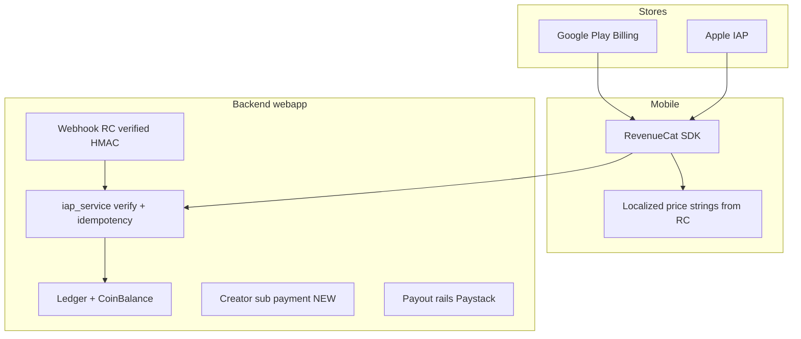

# Enterprise monetization and security roadmap (WiamApp)

## Principles (Boss requirements encoded)

| Layer | Rule |
|--------|------|
| **Truth in backend** | **Coins** are the canonical reader-side unit for spending. **Settlement / accounting rows** store **USD minor units** (integer cents) *or* an explicit **`amount_usd_decimal`** plus `fx_rate_snapshot` where a rail (Paystack/GHS payout) differs—avoid silent float drift. Migrate away from implying “GHS-only” global truth while **Ghana remains an operational pillar** (`COIN_TO_GHS` in [`webapp/services/monetization.py`](webapp/services/monetization.py) today stays until replaced by explicit policies). |
| **Display / UX** | For **Google/Apple IAP SKUs**, show **store-provided localized price strings** via **RevenueCat** (already in [`WiamAppMobile/src/services/iap.js`](WiamAppMobile/src/services/iap.js)) — do **not** invent competitor FX for those labels. For **coin-only flows** (tips, unlocks, gifts), UI emphasizes **coins**; optional fiat hint only from server `pricing_preview` API. Creator-facing earnings can show **preferred payout currency** (often GHS initially). |
| **Google Play acceptance** | All **digital** goods/subscriptions inside the Play-distributed Android app route through **Play Billing** (RevenueCat is fine). Avoid parallel unauthorized card flows for those items. Maintain **subscriptions policy**, ** deceptive behavior**, and **Data safety** accuracy. |

---

## Current state (verified in repo)

### Strengths

- **IAP scaffolding**: [`webapp/services/iap.py`](webapp/services/iap.py) maps SKUs (`PRODUCT_COIN_MAP`, `SUBSCRIPTION_MAP`), aligns with [`WiamAppMobile/src/services/iapProducts.js`](WiamAppMobile/src/services/iapProducts.js). Internal coin value comment: **100 coins = $1 USD** (`COIN_TO_USD = 0.01` duplicated in [`webapp/services/monetization.py`](webapp/services/monetization.py) as `COIN_TO_USD`; `COIN_TO_GHS = 0.05` for legacy GHS-derived reporting).
- **Coin purchases & subs confirm**: `/iap/confirm`, `/iap/confirm-subscription` in [`webapp/routes/api_v1.py`](webapp/routes/api_v1.py); RevenueCat webhook in [`webapp/routes/payment.py`](webapp/routes/payment.py) (verify host uses **`https://wiamapp.com`**, not broken `api.wiamapp.com`—update [`IAP_COMPLETION_PLAN.md`](IAP_COMPLETION_PLAN.md) and env when executing).
- **Virtual economy**: Ledger + unlock/tip paths in [`webapp/services/ledger.py`](webapp/services/ledger.py) and API routes; [`CoinPackage`](webapp/models.py) has `price_usd_cents` + `price_ghs` (dual track already started).
- **Studio Pro**: SKUs and static **GHS labels** in [`webapp/routes/studio_v2_api.py`](webapp/routes/studio_v2_api.py) (`/studio/pro/products`); activation via `/studio/pro/iap-receipt` **currently trusts client** (code comment says webhook reconciliation “Push 9 follow-up”)—**high fraud risk**.

### Critical gaps (must fix for “enterprise E2E”)

1. **Creator subscriptions** — [`subscribe_to_creator`](webapp/services/creator_sub_service.py) **creates `CreatorSubscription` and `_record_earning` with no payment**. This is not safe to market as paid tiers.
2. **Studio Pro activation** — Server grants Pro from client POST without mandatory **RevenueCat / Play verification** path tied to the same idempotency rules as reader IAP.
3. **Gifts** — [`webapp/routes/gift.py`](webapp/routes/gift.py) web `sticker/send`; mobile [`GiftsScreen.js`](WiamAppMobile/src/screens/main/GiftsScreen.js) only **lists received** (`GET /gifts/received`). **Send path + parity** missing or incomplete on mobile.
4. **Pricing / currency story** — Today: IAP SKUs documented in USD ([`IAP_COMPLETION_PLAN.md`](IAP_COMPLETION_PLAN.md)), `CoinPackage.price_ghs`, creator tiers in **`price_ghs`**, Studio Pro UI labels hardcoded **GHS**. Needs a **single policy** so engineering does not fork.

### Pricing sanity check (high level)

- **IAP draft** (~$0.99 for 100 coins) vs internal **100 coins ≈ $1** — **aligned**; larger packs use **bonus coins** as the discount lever (good).
- **COIN_TO_GHS vs COIN_TO_USD** — fixed constants are a **simplification**; for global scale, **creator payout and tax** should not depend on a static coin→GHS for all geographies. Plan: keep coins for readers; **record actual proceed currency** on each IAP event from RC/webhook where possible.

---

## Full WiamLight audit — issue register (security and money)

Research covered [`webapp/`](webapp/), [`WiamAppMobile/`](WiamAppMobile/), [`WiamVoxMobile/`](WiamVoxMobile/), [`payments/`](payments/), [`IAP_COMPLETION_PLAN.md`](IAP_COMPLETION_PLAN.md), [`PAYSTACK_SETUP_GUIDE.md`](PAYSTACK_SETUP_GUIDE.md). Below are **explicit problems** beyond the summary gaps above; each needs a tracked fix.

### Critical / high severity

| ID | Finding | Location | Planned fix |
|----|---------|-----------|-------------|
| **SEC-01** | **JWT user can claim another user’s RevenueCat purchases.** `/iap/confirm` and `/iap/confirm-subscription` credit `request.api_user` but call `verify_rc_purchase(rc_user_id, …)` using **client-supplied** `rc_user_id`. A stolen JWT + victim’s RC `app_user_id` could mis-route credits unless IDs are bound. | [`webapp/routes/api_v1.py`](webapp/routes/api_v1.py) (iap_confirm_*), [`iap.py`](webapp/services/iap.py) `verify_rc_purchase` | **Mandatory:** reject unless `normalize(rc_user_id) == normalize(authenticated user's wiam_id or id)`. Log violations as `FraudAlert`. Optionally drop `rc_user_id` from body and derive subscriber key server-side from JWT only. |
| **SEC-02** | **RevenueCat webhook accepts unsigned traffic when secret unset.** `verify_webhook_signature` returns `True` if `REVENUECAT_WEBHOOK_SECRET` is empty (“Allow in dev mode”) — disastrous if production is misconfigured. | [`webapp/services/iap.py`](webapp/services/iap.py) lines ~438–447 | **Fail-closed in production** (e.g. `RENDER` or `FLASK_ENV=production`): reject with 401 unless secret configured. Dev-only exemption behind explicit env. |
| **SEC-03** | **Silent ledger bypass on IAP credit failure.** `credit_coins_for_iap` falls through to `_fallback_credit` which writes `CoinTransaction` **without** double-entry ledger on exception. | [`webapp/services/iap.py`](webapp/services/iap.py) | Remove silent fallback or require founder alert + manual reconciliation queue; metric/alert on any fallback path. |
| **BUS-01** | **Studio Pro entitlement from trusting client.** | [`webapp/routes/studio_v2_api.py`](webapp/routes/studio_v2_api.py) `/studio/pro/iap-receipt` | Same RC verify + webhook idempotency as reader IAP (Phase E). |
| **BUS-02** | **Creator subscription records earnings with no payment.** | [`webapp/services/creator_sub_service.py`](webapp/services/creator_sub_service.py) `subscribe_to_creator` | Phase D payment gate + feature flag. |

### Medium severity

| ID | Finding | Location | Planned fix |
|----|---------|-----------|-------------|
| **BUS-03** | **Gift subscription web flow creates DB row, no Paystack.** User sees “success” while `GiftSubscription` stays `pending` without payment. | [`webapp/routes/programs.py`](webapp/routes/programs.py) `gift_send` (TODO comment) | Implement checkout **or** remove/hide UI until paid; prevent any webhook from activating gift without verified ref. |
| **POL-01** | **Dual rails: Paystack web** ([`payment.py`](webapp/routes/payment.py), [`premium.py`](webapp/routes/premium.py), [`elite.py`](webapp/routes/elite.py)) **vs IAP mobile.** Risk of policy conflict if Android app directs users to buy same benefits off-Play. | Multiple | Document in MONETIZATION_POLICY: **web Geo + login** acceptable for regional rails; mobile digital goods strictly Billing Library; no deep links that circumvent Play for in-app benefits. Legal review. |
| **SEC-04** | **Dev premium activation API survives in prod for founders.** Reduces blast radius vs all users but still powerful; mobile [`wallet.js`](WiamAppMobile/src/api/wallet.js) exposes call. | [`api_v1.py`](webapp/routes/api_v1.py) `/premium/dev-activate` | Strip from prod builds + env `DISABLE_DEV_PREMIUM_API=1`; optional IP allowlist. |
| **SEC-05** | **Idempotency race:** coin credit checks `CoinTransaction` by `store_transaction_id` — verify DB **UNIQUE** constraint to block double-insert under concurrency. | `w_coin_transactions` | Migration: `UNIQUE(store_transaction_id)` where not null + partial index if needed. |
| **BUS-04** | **Sticker gifts:** mobile receive-only; web send elsewhere. Incomplete E2E. | [`gift.py`](webapp/routes/gift.py), [`GiftsScreen.js`](WiamAppMobile/src/screens/main/GiftsScreen.js) | Phase F API + parity. |
| **VOX-01** | **Voice economy parallel paths** unlock/tip without obvious shared rate-limit wrapper with books. | [`webapp/routes/voice_api.py`](webapp/routes/voice_api.py) | Reuse `_check_rate_limit` patterns from [`ledger.py`](webapp/services/ledger.py); same `wiam_id` normalization tests. |
| **VOX-02** | **WiamVoxMobile IAP duplicate** — same RevenueCat patterns; must inherit SEC-01/02 fixes. | [`WiamVoxMobile/src/services/iap.js`](WiamVoxMobile/src/services/iap.js) | Align after WiamApp hardening. |
| **ADS-01** | **Ad impression / rewarded unlock** endpoints may trust client-reported completions; gameable economics. | [`api_v1.py`](webapp/routes/api_v1.py) ~ad rewarded unlock | Server-side caps, Suspicious Velocity alerts, ideally **validated callbacks** per AdMob docs. |

### Already positive (keep / extend)

| ID | Finding | Location |
|----|---------|----------|
| **GOOD-01** | IAP confirm uses RevenueCat REST verify before credit | [`api_v1.py`](webapp/routes/api_v1.py) |
| **GOOD-02** | Paystack webhook verifies signature | [`payment.py`](webapp/routes/payment.py) |
| **GOOD-03** | Ledger integrates freeze + rate limits for purchase/unlock/tip | [`ledger.py`](webapp/services/ledger.py) |
| **GOOD-04** | FraudAlert model + founder financial views | [`founder.py`](webapp/routes/founder.py), [`models.py`](webapp/models.py) |

---

## Phase A — Policy and data model (1–2 design passes, then migrations)

- **Document** `docs/MONETIZATION_POLICY.md`: canonical units, what is sold where (Play vs Paystack), refund rules, chargeback handling, creator share %, tax posture (informational only—legal review).
- **Schema direction**:
  - Add **`iap_events`** (or extend existing transaction tables) with: `user_id`, `product_id`, `store`, `store_transaction_id` **UNIQUE**, `price_amount_micros` / `currency_code` from Google when available, `processed_at`, `idempotency_key`.
  - **Creator sub**: add `payment_status`, `payment_provider`, `external_ref`, `amount_cents_usd` (or store currency), link subscription **only after** verified payment (or Play subscription SKU if you move creator support to a platform fee model—see Phase D).
- **FX / display**: Add **`GET /api/v1/pricing/display`** returning `locale`, `coin_faq_url`, and **non-IAP** hints only; IAP rows still use **RC `localizedPriceString`**.

---

## Phase B — Google Play / Apple / RevenueCat “hard E2E”

- Complete [`IAP_COMPLETION_PLAN.md`](IAP_COMPLETION_PLAN.md) **Phase 2–6** with **live** products, **webhook URL on `wiamapp.com`**, `REVENUECAT_*` on Render, `EXPO_PUBLIC_RC_*` on EAS.
- **Idempotency**: ensure duplicate `transaction_id` / RC event IDs cannot double-credit ([`webapp/services/iap.py`](webapp/services/iap.py) audit + tests).
- **Restore purchases** and **refund** handling (webhook path) covered and logged.

---

## Phase C — WiamPremium + WiamElite (reader platform subs)

- Mobile: [`PremiumTabScreen.js`](WiamAppMobile/src/screens/main/PremiumTabScreen.js) + IAP — enforce **premium_status** server-side (`premium_service`) for **all** privileged routes.
- Play policy: **Manage subscription** link, **feature list**, **free trial** only if implemented truthfully.
- Security: **no client-only unlock**; JWT may cache but **spend/unlock** re-validates server.

---

## Phase D — Creator subscriptions (reader → creator) — rebuild payment gate

**Choose one model** (decision required before coding—default recommendation for Google compliance on Android):

- **Option 1 (recommended for compliance simplicity):** Treat “subscribe to creator” as **in-app digital subscription** → needs **Play-managed subscription SKUs** (complex: many creators) **or** a **small set of platform “patronage” tiers**—often productized later.
- **Option 2 (pragmatic MVP):** **Coins-only** “monthly support” (deduct coins monthly via server job) **or** one-time **coin bundle** that grants **time-limited perks**—still no fake “GHS subscription” without payment.
- **Option 3:** **Paystack** for creator subs **only** on **web**; **mobile** links to web checkout for that SKU class (strictly **must not** circumvent Play rules for digital content accessed in app—**legal/product review** required before relying on this).

Implementation plan: **stop advertising paid creator tiers** in app until one option is fully wired; **feature-flag** `/api/v1/creator-sub/subscribe` for production.

---

## Phase E — Studio Pro (Creator Pro)

- Add **dedicated RC offerings** for `wiamstudio_pro_*` (must exist in Play Console with **localized prices**).
- **Remove trust-the-client** as sole authority: `/studio/pro/iap-receipt` either **deprecated** or only **optimistic UI**; **server grants Pro** from **verified RC webhook** or **REST verify** same as reader subs.
- Move static `price_label` from [`studio_v2_api.py`](webapp/routes/studio_v2_api.py) to **client showing RC prices** + optional admin `PlatformConfig` for marketing copy only.

---

## Phase F — Coins, tips, gifts

- **Tips / unlocks**: rate limits, anomaly detection (burst tips same chapter), **`wiam_id` vs `user.id`** consistency (already burned you once—extend tests).
- **Gifts**: **JWT `POST /api/v1/gifts/send`** (or migrate `gift_bp` to API v1) mirroring [`gift.py`](webapp/routes/gift.py): validate sticker catalogue server-side; **never trust client prices**; full **ledger** linkage.
- **Ad rewarded unlock**: [`api_v1.py`](webapp/routes/api_v1.py) path—add **anti-abuse** (daily cap, fraud signals, invalid ad completion).

---

## Phase G — Creator payouts (fiat out)

- **Operational**: Founder dashboard flows in [`webapp/templates/founder/withdrawals.html`](webapp/templates/founder/withdrawals.html) + Paystack transfers in [`payroll_service.py`](webapp/services/payroll_service.py) — **runbook**: KYC tiers, minimum payout, **manual approval** threshold, **dual control** optional.
- Record **immutable ledger** payout rows; reconcile monthly.

---

## Phase H — Security / anti-fraud (cross-cutting)

| Control | Applies to |
|---------|------------|
| **Webhook HMAC** — production **must** reject if secret missing (SEC-02) | [`iap.py`](webapp/services/iap.py) |
| **RC subscriber == JWT user** (SEC-01) | `/iap/confirm*` |
| **Idempotent keys** (`store_transaction_id` UNIQUE), RC event idempotency | IAP, Paystack verify |
| **Rate limits** (per user/IP) | `/iap/confirm*`, `/coins/unlock`, `/tip`, gift send, **`voice_api` unlock/tip** |
| **Server-side price** — coin costs from DB only | Gifts, unlocks |
| **No entitlement from client blob** | Studio Pro |
| **Account freeze path** (`account_frozen`) | Wallet APIs |
| **Audit log** export for disputes | Founder tools |
| **Secrets rotation** | Render/EAS; never commit leaked env (rotate Neon/password note in project rules) |
| **JWT strength + rotation runbook** | `SECRET_KEY` / signing key |

---

## Phase I — Google Play acceptance checklist (non-code)

- Data safety form matches **what you collect** (wallet, purchases, ads).
- **Subscriptions** policy: clear terms, cancel path, pricing (localized display from stores).
- **Play Billing Lab** / internal testing purchase matrix documented in [`WiamAppMobile/docs/PLAY_RELEASE_CHECKLIST.md`](WiamAppMobile/docs/PLAY_RELEASE_CHECKLIST.md) (fix API base URL bullet to `wiamapp.com` when executing doc pass).

---

## Phase J — Global scale assumptions (what it is, and when it matters)

**What it is:** Phase J is **not** a near-term build checklist. It is a **labeled bucket of “we will need to redesign or add rails when the business crosses these lines.”** It keeps Phases A–I honest: they get you to a **strong regional product with global-ready plumbing**; Phase J is the **explicit reminder** of what “huge ecosystem” still forces later — so nobody mistakes today’s plan for finished international financial infrastructure.

**Why it exists:** At small scale you can run on **one payout region, one tax posture, one fraud team, manual reviews**. At large scale, **law, tax, payment partners, and abuse economics** dominate. Writing Phase J down avoids panic refactors.

**Typical contents (assumptions + triggers):**

- **Payout geography:** Creators paid outside Ghana / West Africa rails → need **multi-currency payout providers**, **beneficiary KYC tiers**, **minimum payout** rules per country, **sanctions / PEP** screening policy (even if “light” at first — document when to engage counsel).
- **Consumer tax / IAP:** **VAT / GST / sales tax** on digital subscriptions and who remits (platform vs store) varies by country — trigger: **material revenue** in regulated markets; usually **accountant + local advice**, not only engineering.
- **Creator subscription product shape:** “One SKU per creator” does not scale to millions of creators on Play — trigger: **catalog or compliance pain** → pivot to **platform patronage tiers**, **coins-only support**, **web checkout** (law-approved), or **limited featured subscriptions**.
- **Ledger & reporting:** Investors, audits, chargebacks — trigger: **volume** → **monthly close** process, **immutable event store** or export, **SOX-style** access controls if ever required.
- **Fraud & trust at scale:** Coordinate refund abuse, gift laundering, farming — trigger: **automated risk scoring**, **withdrawal holds**, **partner risk APIs** (beyond today’s `FraudAlert`).
- **Multi-product (WiamVox, etc.):** Shared identity and **cross-surface abuse** (coins earned in one surface spent in another) — same **SEC-01-style binding** and **unified ledger** policies; Phase J says **when** to split vs unify reporting for finance.

**How to use it:** Review Phase J **once per quarter** or when any trigger fires (new country payouts, spike in refunds, Play policy change). Update [`docs/MONETIZATION_POLICY.md`](docs/MONETIZATION_POLICY.md) with dated “scale decisions,” not guesses in code comments.

---

## Deliverables (documentation this plan expects)

| File | Purpose |
|------|---------|
| [`docs/ENTERPRISE_MONETIZATION_SECURITY_PLAN.md`](docs/ENTERPRISE_MONETIZATION_SECURITY_PLAN.md) (new, **canonical**) | Merge of this roadmap + audit register—**saved on execution** so Boss and agents have one file under version control |
| [`docs/MONETIZATION_POLICY.md`](docs/MONETIZATION_POLICY.md) (new) | Units, rails, shares, refunds, Play vs Paystack; **Phase J triggers** appendix (review quarterly) |
| [`docs/MONETIZATION_E2E_TEST_MATRIX.md`](docs/MONETIZATION_E2E_TEST_MATRIX.md) (new) | Row per flow: happy path, refund, idempotency, abuse |
| Update [`IAP_COMPLETION_PLAN.md`](IAP_COMPLETION_PLAN.md) | Webhook host `wiamapp.com`, fail-closed secret behavior |
| Update [`docs/AGENT_MEMORY.md`](docs/AGENT_MEMORY.md) | Pointer to ENTERPRISE plan |
| Optional cross-link [`docs/WiamVox_product_roadmap_v1_v5.md`](docs/WiamVox_product_roadmap_v1_v5.md) | Voice economy inherits same security patterns |

---

## Open decision (blocker for Phase D)

Creator paid subscriptions on **Android** need an explicit **compliance-chosen** model (Play Billing complexity vs web rail vs coins-only). **Boss / legal** must pick **Option 1, 2, or 3** above before engineering locks schema.

---

## Execution order (recommended)

1. **SEC-01 + SEC-02** (RC user binding, webhook fail-closed) — before any scale traffic.  
2. Phase B (IAP E2E + webhook hardening + UNIQUE transaction id).  
3. Phase H remainder (rate limits IP-level, ad abuse, dev-premium strip).  
4. Phase E (Studio Pro verification).  
5. Phase F (gifts mobile + API).  
6. Phase D after **Option** choice.  
7. **`docs/ENTERPRISE_MONETIZATION_SECURITY_PLAN.md`** consolidation + Phase A policy in parallel with early security work.  
8. **Phase J:** no sequential block — quarterly (or on trigger) policy review documented in MONETIZATION_POLICY.
