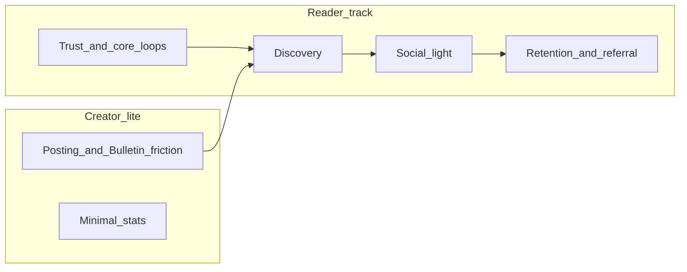

# Reader-first growth master plan (WiamApp)

**Bias:** Maximize **reader acquisition, activation, retention, and word-of-mouth**. **Creators** get a **thin, high-leverage** slice (supply quality and posting rhythm)—not a parallel mega-roadmap.

**Related plans (do not merge into one file forever):**

- [`.cursor/plans/enterprise_monetization_e2e_5ade2d9a.plan.md`](c:\Users\DELL\.cursor\plans\enterprise_monetization_e2e_5ade2d9a.plan.md) — money, Play compliance, fraud SEC-01/02.
- [`.cursor/plans/social_identity_community_721e0e01.plan.md`](c:\Users\DELL\.cursor\plans\social_identity_community_721e0e01.plan.md) — usernames, mentions E2E, community surfaces, phone posture.
- [`.cursor/plans/wiamvox_roadmap_+_launch_docs_acc9b8d2.plan.md`](c:\Users\DELL\.cursor\plans\wiamvox_roadmap_+_launch_docs_acc9b8d2.plan.md) — WiamVox phases (post WiamApp stabilization).
- Launch hygiene: [`WiamAppMobile/docs/PLAY_RELEASE_CHECKLIST.md`](WiamAppMobile/docs/PLAY_RELEASE_CHECKLIST.md), [`docs/AGENT_MEMORY.md`](docs/AGENT_MEMORY.md).

---

## P0 — Ship-safe and trust (readers feel “it works”)

| Item | Why (reader) | Where to work |
|------|----------------|---------------|
| Production **API base** and env parity | Broken auth/progress = churn | [`eas.json`](WiamAppMobile/eas.json), Render env, fix checklist drift in [`PLAY_RELEASE_CHECKLIST.md`](WiamAppMobile/docs/PLAY_RELEASE_CHECKLIST.md) |
| **Continue reading / home / progress** correctness | Core habit loop | Already fixed areas in [`api_v1.py`](webapp/routes/api_v1.py), [`home_sections_v2.py`](webapp/services/home_sections_v2.py), mobile cache keys — **regression tests** on `wiam_id` vs `id` |
| **IAP / wallet** honest paths | Paying readers must not doubt the app | Execute monetization plan **SEC-01, SEC-02** first |
| **Google sign-in** configured in prod | Largest funnel for Android | [`AGENT_MEMORY.md`](docs/AGENT_MEMORY.md) Go-live notes |

---

## P1 — First-session activation (reader “hero loop”)

Goal: In **one session**, user **finishes a satisfying read moment** and **has a reason to return**.

- **Onboarding → genre/taste → personalized home** — already partially there via [`home_sections_v2.py`](webapp/services/home_sections_v2.py) and onboarding; validate **empty catalog** fallback copy and section count.
- **“Add to library” nudge** near first deep read — continue-reading eligibility is tied to library in product rules; make the **why** obvious in UI once.
- **One follow** prompt (creator) after positive engagement — feeds Bulletin and return reasons without building new social infra.

**Creator (little):** Ensure **new chapter** notifications are reliable for followers ([`notifications`](webapp/services/notifications.py)); readers only care that **updates show up**.

---

## P2 — Discovery (readers find the next book)

- **Search quality** — verify mobile + API search paths; typos; genre filters.
- **“Because you read” / similar** — strengthen weighting and dedup with home assembly (already has registry in [`home_sections_v2.py`](webapp/services/home_sections_v2.py)).
- **Book detail** clarity: cover, chapter access, lock/premium/coins explained in one glance — reduces bounce.

**Creator (little):** **Schedule / new chapter** visibility in reader notifications only; no heavy dashboard work in this track.

---

## P3 — Reader social (lightweight, not a city square)

Per [social plan](c:\Users\DELL\.cursor\plans\social_identity_community_721e0e01.plan.md):

| Build | Reader value |
|-------|----------------|
| **@mentions E2E** in paragraph/book comments | Conversation feels alive; uses existing `notify_mention` + settings |
| **“Discussion” density** | Optional: book-level thread list or curated “active paragraphs” — **book-scoped**, easier to moderate than global chat |
| **Bulletin** stays **creator broadcast + emoji reactions** ([`bulletin.py`](webapp/routes/bulletin.py)) — do **not** convert to open reader chat without moderation budget |

**Creator (little):** Pin one post / clearer book_share in Bulletin if low effort — helps readers discover **next** title from a creator they already like.

---

## P4 — Retention and referral (readers invite readers)

- **Streaks / missions** — leverage existing programs (see [`programs.py`](webapp/routes/programs.py) patterns) without over-punishing misses.
- **Push discipline** — meaningful: new chapter from **followed** creators, mentions, gift/reply; avoid generic spam.
- **Referral** — honest reward, abuse caps (ties to ledger/fraud stance in monetization plan).

**Creator (little):** Optional “share this story” assets (link + cover) — mostly **reader-facing share** from book detail.

---

## P5 — Polish and scale (after P0–P4 moving)

- Profile/drawer IA cleanup when ready ([`docs/WiamApp_reader_creator_plan_v1.md`](docs/WiamApp_reader_creator_plan_v1.md)) — **reader settings and library privacy** first tabs.
- Audio / WiamVox — follow separate roadmap; **not** in this reader sprint.

---

## Deliverable on execution

| File | Action |
|------|--------|
| [`docs/WiamApp_reader_first_growth_plan.md`](docs/WiamApp_reader_first_growth_plan.md) | Create from this plan + dated priorities |
| [`docs/AGENT_MEMORY.md`](docs/AGENT_MEMORY.md) | Pointer: “current growth track = reader-first master plan” |

---

## Execution order (recommended)

1. **P0** until Play internal testing is credible.  
2. **P1 + P2** in parallel (activation + discovery).  
3. **P3** mentions before large new forum tables.  
4. **P4** once daily active readers justify referral spend.  
5. **Creator-lite** items **only** where they unblock P1–P2 (notifications, posting friction).

---

## Explicitly out of scope here (use other plans)

- Full monetization E2E except trust blockers — monetization plan.  
- WiamVox live audio — WiamVox roadmap.  
- Heavy creator analytics, payouts UX, Studio Pro — defer or minimal.
