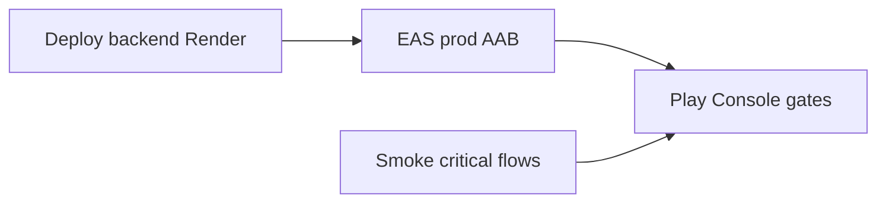

# Save WiamVox roadmap + WiamApp launch alignment

## Goals

1. **Archive the WiamVox v1→v5 plan** Boss described (voice-first storytelling, genres, recorded episodes first, **podcast-style live shows**: 2–3 on mic + large audience — *“radio” was only an analogy for the pattern, not the product category*; prefer **podcast / storytelling audio** in copy) in the repo so future sessions inherit it verbatim.
2. **Tie near-term work to “WiamApp launch very soon”** by pointing at the authoritative checklist and surfacing anything that contradicts prod config.

## Artifact to add

Create **[`docs/WiamVox_product_roadmap_v1_v5.md`](docs/WiamVox_product_roadmap_v1_v5.md)** with:

- **Terminology:** User-facing and doc language: **podcast / voice storytelling / live audio show** — not “we are building a radio station.” The *shape* is “few speakers, many listeners” (like classic radio), but **positioning = podcast + storytelling platform**.
- **Positioning:** WiamLabs = umbrella; WiamApp = read + creator tooling; WiamVox = listen (+ later live storytelling).
- **Dependency:** Ship and stabilize **WiamApp** first; WiamVox extends **same auth, APIs, Postgres** (`webapp/` + existing `User` model); new domains get **additive tables/routes**, not duplicate identity.
- **Phases (v1–v5)** — reuse the structured content already agreed in chat:
  - **v1:** Catalog + recorded episodes + genres + playback + creator publish MVP.
  - **v2:** Follow/discovery/notifications/resume/policy hooks.
  - **v3:** Live **podcast-style** / live storytelling audio MVP (host + ≤2 guests), one-to-many listeners, optional recordings→VOD, optional reactions **or** slow chat (one lane).
  - **v4:** Monetization lane (tips/memberships/tickets — one first), moderation depth, scheduling, creator analytics.
  - **v5:** Ecosystem bridges with WiamApp, flagship events, controlled audience participation — still not “many simultaneous live actors.”
- **Non-goals:** “Build our own global streaming cloud” deferred until scale forces it; reuse managed/broadcast primitives under the application layer for v3.
- **Cross-links:** [`docs/WiamApp_reader_creator_plan_v1.md`](docs/WiamApp_reader_creator_plan_v1.md) (Profile/dashboard backlog), [`WiamAppMobile/docs/PLAY_RELEASE_CHECKLIST.md`](WiamAppMobile/docs/PLAY_RELEASE_CHECKLIST.md) (public launch sequencing).

Optional short **mermaid** diagram: `SharedIdentity` → `WiamApp` / `WiamVoxClient` → `webapp API` → `Postgres`.

## Documentation fixes tied to launch (WiamApp)

- **Correct stale API checklist line:** [`WiamAppMobile/docs/PLAY_RELEASE_CHECKLIST.md`](WiamAppMobile/docs/PLAY_RELEASE_CHECKLIST.md) §1 currently marks production API as `https://api.wiamapp.com/api/v1`; project reality and **[`WiamAppMobile/eas.json`](WiamAppMobile/eas.json)** use **`https://wiamapp.com/api/v1`** (per `.cursor/rules/project-context.mdc`, `api.wiamapp.com` DNS is unreliable). Update that bullet so Play prep matches production builds.

## Working memory hook

After the doc lands, append a dated one-paragraph stub to **[`docs/AGENT_MEMORY.md`](docs/AGENT_MEMORY.md)** pointing at `docs/WiamVox_product_roadmap_v1_v5.md` and restating Boss’s sequencing (**WiamApp launch first**). Keeps continuity with your “read AGENT_MEMORY first” protocol.

## WiamApp “launch very soon” — what to prioritize (reference only)

Do **not** replace the checklist; treat this as ordering:

- **Backend:** Push `master` → Render auto-deploy; confirm critical fixes (reading progress IDs, studio cover validation, notifications, Google `/auth/google` env parity) live.
- **Mobile:** Fresh **production** EAS Android build ([`WiamAppMobile/docs/EXPO_BUILD.md`](WiamAppMobile/docs/EXPO_BUILD.md)); **`eas init`** if `extra.eas.projectId` is still placeholder ([checklist §0a](WiamAppMobile/docs/PLAY_RELEASE_CHECKLIST.md)).
- **Secrets:** Render `GOOGLE_CLIENT_ID`/audience aliases + matching `EXPO_PUBLIC_GOOGLE_*` in EAS (see [`docs/AGENT_MEMORY.md`](docs/AGENT_MEMORY.md) Go-live notes).
- **Play policy timeline:** Closed testing minimum **14 days** for new Console accounts ([checklist §0](WiamAppMobile/docs/PLAY_RELEASE_CHECKLIST.md)) — parallelize engineering with account verification.
- **QA source of truth:** `playstore-readiness` job in [`.github/workflows/qa-enterprise-ceo-rest-mode.yml`](.github/workflows/qa-enterprise-ceo-rest-mode.yml); keep `app.json` aligned so CI gates stay meaningful.

---

## Out of scope (this change set)

Implementing Profile dashboard items from [`docs/WiamApp_reader_creator_plan_v1.md`](docs/WiamApp_reader_creator_plan_v1.md) or any WiamVox code —Boss asked to **save the plan** and orient launch, not ship features in this chunk.
